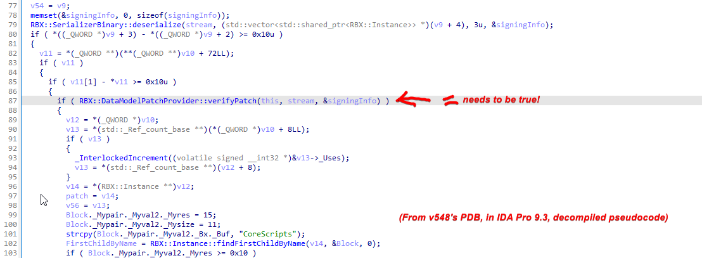
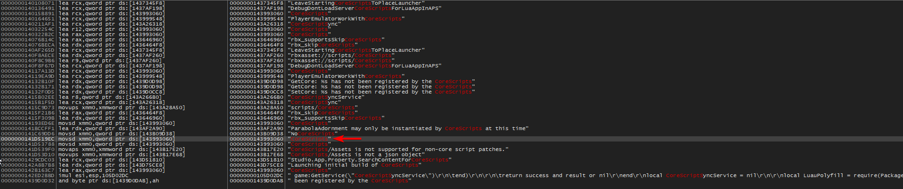
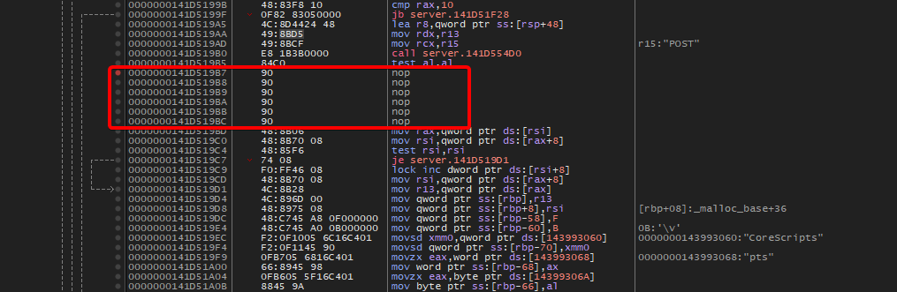

## DataModelPatch.rbxm
Patching DataModelPatch.rbxm lets you patch, modify, and run CoreScripts/CoreGuis and change just about anything. Even use exclusive services meant for ROBLOX admins (such as HttpRbxApiService, RobloxReplicatedStorage)

**A prepatch is included but the offsets _may be wrong_, the patch was made on Jetray's RobloxStudioBeta v535, that has local_rcc pre-patched inside of it.**

### Versions Patched:
- 0.535 Studio

## Where does this start?
DataModelPatch.rbxm is (in my theory) a "hotfix" .rbxm file that gets applied at the start of your studio session.

It is located in ``\Studio\ExtraContent\models\DataModelPatch\``

 If (in my theory) the contents of the .rbxm is changed, the SIGN chunk of the rbxm fails to match a number of preset hashes, thus causing an error message:

``No verified patch could be loaded``

To ensure accuracy, you can modify DataModelPatch.rbxm by swapping the .rbxm with a modified one and see what error you get (it can be in output too)

**BEWARE:** your modified .rbxm must satisfy these requirements or it returns null even after making this patch:

- Folder named "PatchRoot"
  - Must have a child named "CoreScripts" with at least one child inside it
  - Must have a child named "DataModelInstances" with at least one child inside it

### Analysis using 0.548's PDB
An ``if statement`` checks if the patch is verifiable. If we want to apply our custom DataModelPatch, we need to make sure this statement returns true, or have this check skipped.



## 0.535 Studio
Using RFD, I ran ``python .\_main.py studio --web_port 2005 --config_path .\GameConfig.toml --debug``
- Prior to this, I changed the ``x96dbg`` directly where ``x96dbg`` is located, adding to PATH wasn't working. The code is located in ``Source\routines\_logic.py``

In ``x64dbg``, click on the ``Symbols`` tab and click on ``robloxstudiobeta.exe``

Right click > Search for > Current Module > String References

Search for the string ``No core scripts when deserializing patch`` or ``CoreScripts``

Found it? Good. If you searched for ``CoreScripts`` you'll be right below the statements to patch.


Otherwise:

``No verified patch could be loaded``  Found it? Good, but you may be on your own since I didn't cover patching using this string as the entry point. You'll likely need to scroll up, A LOT.

##

Once I was at that string, I got the offset between our ``if statement`` and entry point ``No core scripts when deserializing patch``.
You can use https://www.calculator.net/hex-calculator.html?number1=141D51ACE&c2op=-&number2=133&calctype=op&x=Calculate

0.548 PDB:
```
0x141F89C20 > if statement here
0x141F89D53 > "no core scripts" here
```

0.535 in x64dbg:
```
0x141D51ACE > "no core scripts" here.

Offset: 
548 if statement:      0x141F89C20
548 no core scripts:   0x141F89D53
548 offset between:    0x141F89D53 - 0x141F89C20 = 0x133
in v535, estimated location: 0x141D51ACE - 0x133 = 0x141D5199B <---
```

Pressing ``Ctrl+G`` and jumping to ``0x141D5199B``, I land just above our call ``if statement``

"CoreScripts" string here right above a "pts" and below a '\v'

You're looking for:
```
call
test
jz/je
mov
mov
test
jz
lock inc
mov
```
Replace the je with nop until theres 6 nops
