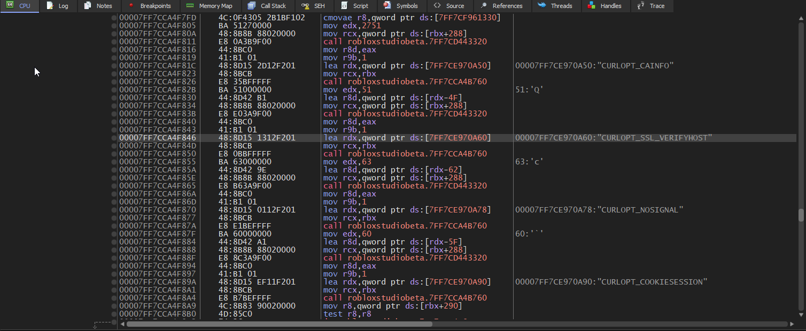
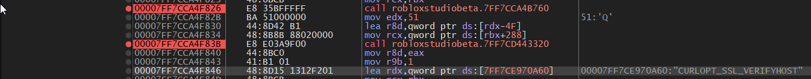
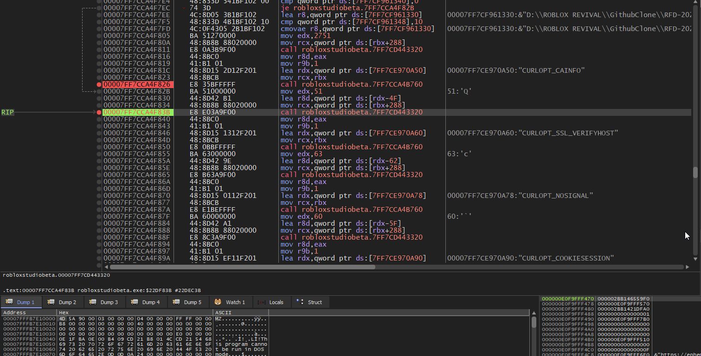
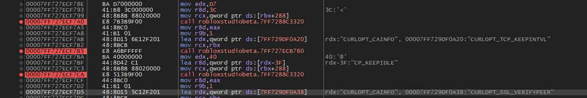
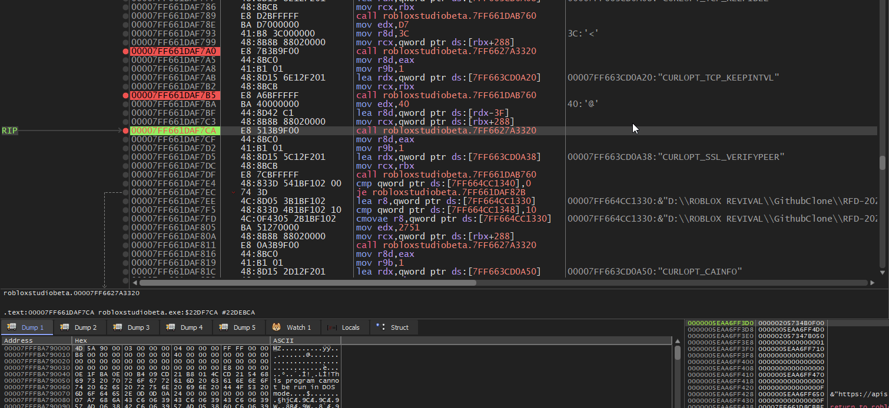
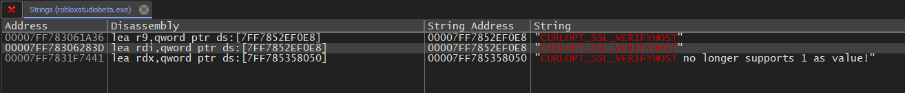
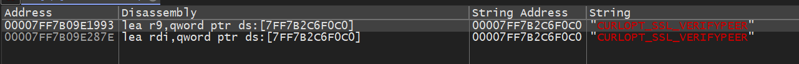
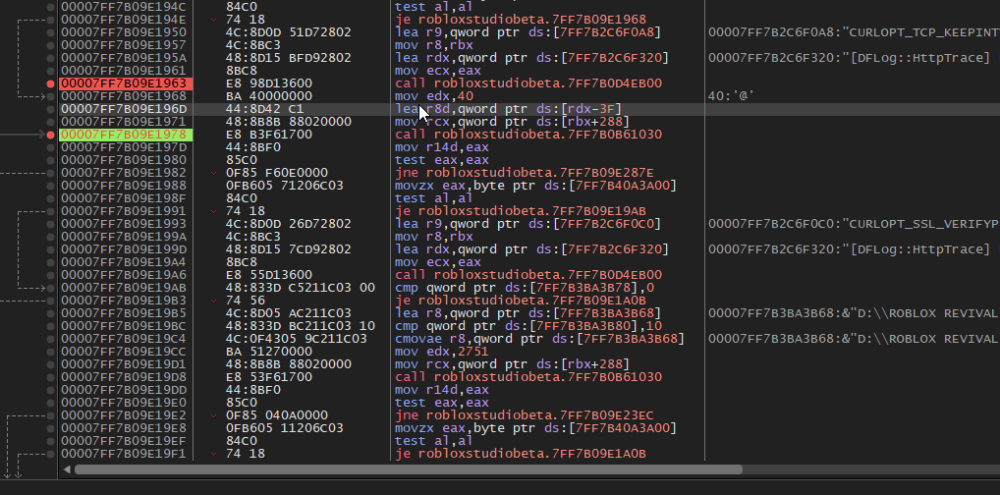

This is essentially just a rewording of **VisualPlugin's Guide [here](https://github.com/Windows81/Roblox-Freedom-Distribution-Guides/tree/f386f1f9afc92303db548bb6ad6ce18196eaee7d/PatchTLSVerification)**

### Versions Patched:
- 0.548 Studio
- 0.554 Studio

## whar?
VisualPlugin gave us this quick guide:

1. Search among user-referenced strings for ``"CURLOPT_SSL_VERIFYPEER"`` and ``"CURLOPT_SSL_VERIFYHOST"``, taking into account for results from both searches.

2. For each result, navigating up about 10 instructions until you find one until you see a constant value 0x40 or 0x51.

    - Ex: ``push 40``, ``mov r8d, 51``, et c.
    - If one is not found, it is probably safe to skip to the next result.

3. Look nearby for a statement which uses 1 or 2 as a constant value.

    - Ex: ``push 1``, et c.
    - If one is not found here, best to set a breakpoint at the call that takes place after and take other unexplained measures.

4. Re-assemble the statement from (3) so as to replace 1 or 2 with 0.

## 0.548 Studio
Using RFD, I ran ``python .\_main.py studio --web_port 2005 --config_path .\GameConfig.toml --debug``
- Prior to this, I changed the ``x96dbg`` to run ``x64dbg`` instead, it's located in ``Source\routines\_logic.py``
- If you're having trouble, you need to have x64dbg in your system environment variables (PATH)

I found only one result for ``CURLOPT_SSL_VERIFYHOST``

There's two calls above the string, I set breakpoints on those: 
Then hit ``Run``.

x64dbg gives me the following callstack:
```
1: rcx 00000298F2627630 00000298F2627630
2: rdx 00007FF7CE970A50 robloxstudiobeta.00007FF7CE970A50 "CURLOPT_CAINFO"
3: r8 0000000000000000 0000000000000000
4: r9 0000000000000001 0000000000000001
5: [rsp+20] 000000E9BABFFA20 000000E9BABFFA20
```
Doesn't look right. The next callstack:
```
1: rcx 00000298F4029F40 00000298F4029F40
2: rdx 0000000000000051 0000000000000051
3: r8 0000000000000002 0000000000000002
4: r9 0000000000000001 0000000000000001
5: [rsp+20] 000000E9BABFFA20 000000E9BABFFA20
```
This is what we're looking for. I took the same shortcut that VisualPlugin took:


However, we're still not done. Search for ``CURLOPT_SSL_VERIFYPEER``. 

I only see one result, so let's head there.

I set three breakpoints above the result:


On the third callstack, we get this, which is what we're looking for:
```
1: rcx 00000205737EA200 00000205737EA200
2: rdx 0000000000000040 0000000000000040
3: r8 0000000000000001 0000000000000001
4: r9 0000000000000001 0000000000000001
5: [rsp+20] 0000005EAA6FF710 0000005EAA6FF710
```

Again, we can take the same shortcut VisualPlugin took for ``VERIFYHOST``:


Finally, patch the file and save it.

## 0.554 Studio
Searching for ``CURLOPT_SSL_VERIFYHOST``, we find two results:

For both of these results, we set breakpoints on 2 calls above, just to see.

After running, the second breakpoint is hit with the callstack we're looking for, rdx being ``rdx 51`` and ``r8 2``
I took the same shortcut I took for ``0.548``, chaning the lea to ``xor r8d, r8d`` and then ``nop``

Next, we search for ``CURLOPT_SSL_VERIFYPEER``. 

Again, two results. Wow, they really amped up their security! Oh geez...
For both of these results, we set breakpoints on 2 calls above, like before.


The second breakpoint is hit again, with the callstack we're looking for:
```
1: rcx 000001D4EFE04050 000001D4EFE04050
2: rdx 0000000000000040 0000000000000040
3: r8 0000000000000001 0000000000000001
4: r9 0000000000000001 0000000000000001
5: [rsp+20] 000001D4EFF43400 000001D4EFF43400 "https://apis.rbolock.tk:2005/oauth/.well-known/openid-configuration"
```
Interestingly, our OAuth login showed up too. Kewl.

Likewise, same shortcut as before. Here's a gif to please your eyes:


Finally, patch the file and save it.