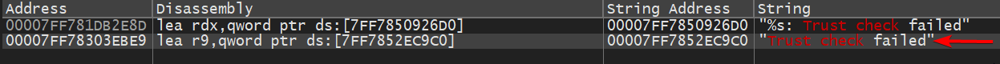

# Trust Check Failed / DnsResolve

## For Studio:
1. Open RobloxStudioBeta in x64dbg
2. Select robloxstudiobeta.exe from the Symbols tab, you'll switch over to CPU tab
3. Right Click -> Search For -> Current Module -> String References
4. Search "Trust Check"
5. Find the trust check result that DOESN'T have an %s and double click it
    - 
6. Find the "jne roblox"-something line above the trust check, and assemble, change it to jmp
7. Apply patches and save

## For Player:
1. idk